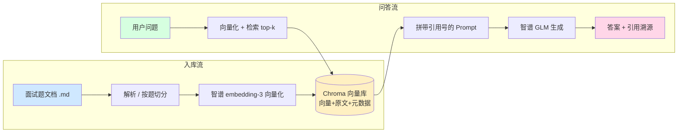

# 校招软件开发面试题库 · RAG 垂直问答系统

> 一个面向「校招软件工程师」面试备考场景的 **检索增强生成（RAG）** 垂直问答系统。
> 上传面试题文档 → 自动按「题」切分向量化 → 基于检索增强生成答案 → **答案带引用溯源**。
> 非商用学习作品，用于展示「能应对真实业务场景」的工程能力。

---

## ✨ 功能特性

- 📥 **文档入库**：上传 `.md / .txt` 面试题文档，自动按「题」切分（保留单题语义完整性）
- 🧠 **向量化**：调用智谱 `embedding-3` 生成 2048 维向量，入库与检索**同一模型同源**
- 🔍 **语义检索**：Chroma 持久化向量库，ANN 近似最近邻检索 top-k 相关片段
- 🤖 **RAG 问答**：检索片段 + 问题拼入受约束 Prompt，交由智谱 GLM 生成答案
- 📎 **引用溯源**：每道题带 `科目/题号/来源` 元数据，答案下方可展开查看出处卡片
- 🛡️ **真实业务加固**：API Key 中间件鉴权（无/错 Key → 401）、按 IP 限流（超频 → 429）、Pydantic 请求校验（非法 → 422）

---

## 🧱 技术栈

| 层 | 选型 | 说明 |
|---|---|---|
| 后端框架 | **FastAPI** | 异步、自带 OpenAPI 文档、Pydantic 校验天然契合输入校验 |
| 向量库 | **Chroma 1.5.9**（嵌入式） | 向量 + 原文 + 元数据一体存储，本地持久化，最贴合引用溯源 |
| Embedding | **智谱 `embedding-3`** | 2048 维，中文语义强，与 LLM 同生态 |
| 大模型 | **智谱 GLM-4**（开发期 `glm-4-flash`） | 中文问答质量好，需 API Key |
| 前端 | **Vue 3 + Vite** | 组件化，经 Vite 代理 `/api` 对接后端 |

---

## 🏗️ 系统架构

入库流（蓝）把文档变成可检索向量；问答流（绿）把问题变成带出处的答案：



---

## 📁 项目结构

```
project-2/
├── backend/                      # FastAPI 后端
│   ├── app/
│   │   ├── main.py               # 入口：挂载路由 + 注册中间件 + CORS
│   │   ├── api/documents.py      # /upload /search /ask 接口 + Pydantic 校验
│   │   ├── core/
│   │   │   ├── config.py         # 配置中心（从 .env 读密钥与阈值）
│   │   │   └── security.py       # API Key 鉴权 + 按 IP 限流 中间件
│   │   └── services/
│   │       ├── zhipu.py          # 智谱 embedding / 生成 客户端
│   │       ├── vector_store.py   # Chroma 封装（PersistentClient/upsert/query）
│   │       ├── ingestion.py      # 文档解析 + 按题切分 + 入库
│   │       └── rag.py            # RAG 问答：检索→拼Prompt→生成→溯源
│   ├── data/sample_interview.md  # 样例题库（10 科 50 题）
│   ├── scripts/
│   │   ├── verify_stage1.py      # 阶段1 入库/检索验证
│   │   └── reindex.py            # 清空并重新灌入样例题库
│   ├── chroma_db/                # Chroma 持久化数据（gitignore）
│   ├── requirements.txt
│   ├── .env.example
│   └── .env                      # 真实密钥（gitignore，不进仓库）
└── frontend/                     # Vue3 前端
    └── src/
        ├── api.js                # 统一请求层（自动带 X-API-Key，翻译 401/429）
        ├── App.vue               # 两栏布局 + API Key 设置
        └── components/
            ├── UploadPanel.vue   # 上传题库
            └── ChatPanel.vue     # 提问 + 引用卡片
```

---

## ⚙️ 环境要求（重要坑位）

| 依赖 | 要求 | 原因 |
|---|---|---|
| **Python** | **必须 3.12**（禁用 3.13） | `chroma-hnswlib` 全平台**无 cp313 的 wheel**，Chroma 在 3.13 上根本装不上（含 Railway 部署） |
| **chromadb** | **锁 1.5.9**（禁用 0.6.3） | 0.6.3 精确依赖 `chroma-hnswlib==0.7.6`，该稳定版**仅源码包无 wheel**，Windows 源码编译需 MSVC 14；1.5.9 将其降为 dev 可选依赖，无需 MSVC 即可装 |
| 智谱 API Key | 必需 | embedding 与生成均调用智谱开放平台 |
| 网络 | 需访问 `open.bigmodel.cn` | 调用 embedding / 生成接口 |

> 本机使用 `uv` 管理的 `cpython-3.12.14` 建立虚拟环境；**新建 venv / 部署运行时一律 3.12**。

---

## 🚀 快速开始

### 1. 后端

```bash
cd backend

# 用 Python 3.12 建虚拟环境（务必 3.12！）
py -V:Astral/CPython3.12.14 -m venv .venv
.venv/Scripts/activate        # Windows；Linux/macOS 用 source .venv/bin/activate

# 安装依赖（已锁定 chromadb==1.5.9）
pip install -r requirements.txt

# 配置密钥：复制 .env.example 为 .env 并填入
cp .env.example .env
#   ZHIPU_API_KEY=你的智谱Key
#   API_KEYS=dev-rag-2026        # 演示用客户端 Key
#   RATE_LIMIT_PER_MINUTE=30

# 灌入样例题库（10 科 50 题），会清空旧 collection 后重灌
.venv/Scripts/python.exe scripts/reindex.py

# 启动服务
.venv/Scripts/python.exe -m uvicorn app.main:app --host 127.0.0.1 --port 8000
```

启动后访问 `http://127.0.0.1:8000/docs` 可在线调试接口。

### 2. 前端

```bash
cd frontend
npm install
npm run dev      # 默认 http://localhost:5173，Vite 已配置 /api 代理到 8000
```

打开 `http://localhost:5173`：左侧上传 `.md` 面试题 → 右侧输入问题 → 查看答案与引用卡片。

---

## 🔌 API 一览

| 方法 | 路径 | 说明 | 鉴权 |
|---|---|---|---|
| GET | `/health` | 探活（公开，返回 `api_key_set`） | 否 |
| POST | `/api/documents/upload` | 上传 `.md/.txt` 文档并入库 | 是 |
| POST | `/api/search` | 语义检索 top-k 片段（含元数据） | 是 |
| POST | `/api/ask` | RAG 问答，返回 `answer + citations` | 是 |

示例（需带 `X-API-Key`）：

```bash
curl -X POST http://127.0.0.1:8000/api/ask \
  -H "Content-Type: application/json" \
  -H "X-API-Key: dev-rag-2026" \
  -d '{"query":"TCP 三次握手的作用","top_k":2}'

# 返回结构
{
  "answer": "TCP 三次握手的作用是……[1]",
  "citations": [
    {
      "index": 1,
      "source": "sample_interview.md",
      "subject": "计算机网络",
      "q_index": 1,
      "title": "Q1. [基础] TCP 三次握手的过程？",
      "content": "客户端发 SYN；服务端回 SYN+ACK……",
      "distance": 0.6366
    }
  ]
}
```

---

## 🛡️ 鉴权与限流（阶段4）

- **API Key 中间件**（`app/core/security.py`）：请求须带 `X-API-Key`（或 `Authorization: Bearer`）；
  无效 → `401`；`/health`、`/docs` 等公开路径放行。**鉴权中间件注册在最外层，先于限流**——
  无效 Key 直接 401，不消耗限流配额。
- **限流中间件**：按客户端 IP 60 秒固定窗口计数，超 `RATE_LIMIT_PER_MINUTE` → `429`。
- **请求校验**：`SearchRequest` / `AskRequest` 用 Pydantic `field_validator` 校验
  `query` 非空、`top_k∈[1,10]`，非法 → `422`。
- `API_KEYS` 支持逗号配置多个 Key；**为空时退化为不鉴权**（仅开发便利，生产务必配置）。

---

## 📎 引用溯源机制

1. 解析 markdown 时，每个 `### Q` 块作为独立 chunk，元数据记录 `source / subject / q_index / title`；
2. 检索出 top-k 后，给每段编 `[1][2]…`，并在拼给 GLM 的 Prompt 中要求「论断后标 `[n]`、仅用给定资料、无则明说」；
3. GLM 返回后，后端把 `[n]` 映射回对应 chunk 的元数据，随 `citations` 一并返回；
4. **前端按结构化的 `citations` 数组渲染出处卡片**，而非正则解析答案文本——更健壮、也避免 XSS。

---

## 🗂️ 分阶段构建记录

| 阶段 | 内容 | 关键认知 |
|---|---|---|
| 0 | 前后端骨架跑通 | 虚拟环境隔离、配置密钥分离、Vite 代理免跨域 |
| 1 | 入库管线 | Python 3.12 + chromadb 1.5.9 选型坑；智谱 `/embeddings`（复数）接口 |
| 2 | 问答管线 | RAG 三环节（检索→增强→生成）；Prompt 约束 + 低 temperature 抑幻觉 |
| 3 | 前端 | 原生 `fetch` 足够；引用卡片由结构化数据驱动 UI |
| 4 | 业务加固 | 中间件洋葱模型；401 vs 429；统一校验 |

---

## 🔮 后续可扩展

- 真实用户体系（JWT 登录态）、多用户独立知识库隔离
- 分布式限流（Redis 令牌桶）、审计日志
- 支持 PDF / Word 解析（当前仅 `.md/.txt`）
- 检索召回优化：混合检索（向量 + 关键词 BM25）、重排（rerank）
- 一键部署 Railway（Python 锁 3.12 + chromadb 1.5.9，本地 Git → GitHub → Railway 自动重部署）

---

## 🚀 部署（拆分部署：Hugging Face Spaces 后端 + Vercel 前端）

> 已配套准备好所有部署文件：`Dockerfile` / `.dockerignore` / `backend/start.py`（后端 Docker 化）+ `frontend/.env.example`（前端）。GitHub 推送后即可一键部署。
>
> **为什么用 Hugging Face Spaces**：完全免费、不绑卡、只登录 GitHub 即可使用，支持 Docker 部署，我们的 Dockerfile / start.py / .dockerignore / 环境变量全部**零改动直接复用**。
>
> **为什么用 Docker + `start.py`**：`start.py` 直接 `os.getenv('PORT')` 启动 uvicorn，完全绕开 shell 变量展开；Dockerfile 锁 `python:3.12-slim` 避开 `chroma-hnswlib` 的 cp313 wheel 兼容问题。

### 后端：Hugging Face Spaces（Docker Space）

1. 登录 [huggingface.co](https://huggingface.co/)（**用 GitHub 账号**登录）
2. 右上角 `+ New Space`
3. 填 Space 信息：
   - **Space name**: `campus-interview-rag`（影响默认域名）
   - **License**: `MIT`
   - **SDK**: **`Docker`** ⚠️ 关键
   - **Docker template**: `Blank`
   - **Space hardware**: **`CPU basic - free`**（免费够用，2 vCPU + 16GB RAM）
   - **Visibility**: `Public`（作品集要给招聘方看）
4. 创建后跳转到 Space 的 `Files` 页面 → 顶部点 **`Add file → Upload files`** 或者 **`Connect to GitHub`**（推荐后者，自动重部署）
5. **配置环境变量**（关键）：
   - 左侧 **`Settings`** → **`Variables and secrets`** → **`New variable`** 添加 4 个：

   | Name | Value | Secret? |
   |---|---|---|
   | `ZHIPU_API_KEY` | `00a673b656b84ce5a1a33c2c48fdc556.FYoyx9w4OVFXq5p0` | ✅ 选 Secret |
   | `API_KEYS` | `dev-rag-2026` | ❌ |
   | `RATE_LIMIT_PER_MINUTE` | `30` | ❌ |
   | `ALLOWED_ORIGINS` | `*`（先放开，Vercel 部署完再收紧） | ❌ |

6. 完成后 Space 会自动开始构建 Docker 镜像（**首次约 5-10 分钟**，含 pip install + chromadb 下载）
7. 部署完成后 HF 会分配域名 `https://<你的用户名>-campus-interview-rag.hf.space`

8. 验证三件事：
   - 浏览器开 `https://<你的域名>/health` → 应返回 `{"status":"ok","api_key_set":true}`
   - 浏览器开 `https://<你的域名>/docs` → 应看到 Swagger UI
   - 不带 Key POST `/api/ask` → 应返 401

### 前端：Vercel

1. 登录 [vercel.com](https://vercel.com/) → `Add New` → `Project` → 选 `campus-interview-rag`
2. `Root Directory` 设为 `frontend`
3. 在 `Environment Variables` 添加：

   | 变量名 | 必填 | 值 |
   |---|---|---|
   | `VITE_API_BASE` | ✅ | `https://<你的用户名>-campus-interview-rag.hf.space`（HF Space 域名） |

4. `Deploy` → 完成后会得到一个 `*.vercel.app` 域名

### 最后一步：收紧 CORS

回到 HF Space 后端 → `Settings` → `Variables and secrets` → 把 `ALLOWED_ORIGINS` 改成你的 Vercel 真实域名（如 `https://campus-interview-rag.vercel.app`），后端会自动重启生效。

### 关键提醒

- ⚠️ **Python 必须 3.12**：`Dockerfile` 锁死 `python:3.12-slim`，**不要**用 3.13（`chroma-hnswlib` 无 cp313 wheel）
- ⚠️ **Chroma 数据临时性**：HF Space 容器重启 `chroma_db/` 会被清空，但 `main.py` 的 `lifespan` hook 会在启动时**自动从 `sample_interview.md` 重新灌入 50 条基础题库**（已被 ingest 过的真实数据不会被覆盖）
- ⚠️ **HF Space 48 小时休眠**：48 小时无访问会进入休眠，下次访问需冷启动（10-30 秒），作品集演示前手动访问一次"唤醒"即可
- ⚠️ **API Key 替换**：演示用 key `dev-rag-2026` 是给前端 UI 默认填的，**生产请改成你自己的强 key**
- ⚠️ **Secret 标记**：`ZHIPU_API_KEY` 在 HF Space 的 Variables 列表里**必须勾选 Secret**，否则会公开展示在 Space 页面（Vercel 上同理选 Sensitive）

---

## 📄 许可证

非商用学习作品（No License / 仅供学习演示）。所使用的智谱模型请遵守其开放平台服务条款。
