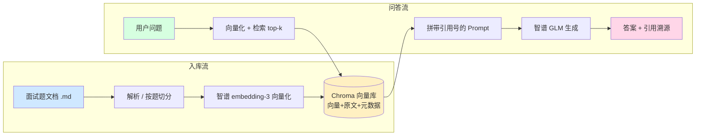

# 校招软件开发面试题库 · RAG 垂直问答系统

> 一个面向「校招软件工程师」面试备考场景的 **检索增强生成（RAG）** 垂直问答系统。
> 上传面试题文档 → 自动按「题」切分向量化 → 基于检索增强生成答案 → **答案带引用溯源**。
> 非商用学习作品，用于展示「能应对真实业务场景」的工程能力。

---

> **👋 招聘方 / 面试官你好**：本作品集采用「**代码优先**」的展示方式。
>
> - 📦 **完整代码**就是作品本身：GitHub 仓库包含全部源码、架构图、API 文档、分阶段实现记录
> - 🛠️ **5 分钟本地跑通**：克隆 → 填密钥 → `uvicorn` 启动 → 浏览器访问 `http://localhost:5173`（步骤见下方「快速开始」）
> - 🎯 **设计要点**：鉴权中间件、限流、引用溯源机制、自动 seed 等工程化细节在代码注释 + 文档里讲清
> - ✅ **已云端部署（Render Free）**：`https://campus-interview-rag.onrender.com`，Docker 多阶段构建，自动 seed 70 道样例题库；embedding 走阿里百炼 DashScope、生成走智谱 GLM
> - 💼 **本地也能跑**：不想看线上，按下方「快速开始」5 分钟起本地服务（需要自备 API Key）

---

## ✨ 功能特性

- 📥 **文档入库**：支持 **14 种格式**（Word / PDF / PPT / Excel / CSV / JSON / HTML / Markdown / TXT 等），自动按「题」切分（保留单题语义完整性）；单文件 10MB 上限 + 类型白名单 + 老格式转换建议
- 🧠 **向量化**：默认用阿里百炼 `text-embedding-v3`（1024 维），亦可切回智谱 `embedding-3`（2048 维）；入库与检索**同一模型同源**（`EMBEDDING_PROVIDER` 环境变量切换）
- 🔍 **语义检索**：Chroma 持久化向量库，ANN 近似最近邻检索 top-k 相关片段
- 🤖 **RAG 问答**：检索片段 + 问题拼入受约束 Prompt，交由智谱 GLM 生成答案
- 📎 **引用溯源**：每道题带 `科目/题号/来源` 元数据，答案下方可展开查看出处卡片
- 🛡️ **真实业务加固**：API Key 中间件鉴权（无/错 Key → 401）、按 IP 限流（超频 → 429）、Pydantic 请求校验（非法 → 422）

---

## 🧱 技术栈

| 层 | 选型 | 说明 |
|---|---|---|
| 后端框架 | **FastAPI** | 异步、自带 OpenAPI 文档、Pydantic 校验天然契合输入校验 |
| 向量库 | **Chroma 1.5.9**（嵌入式） | 向量 + 原文 + 元数据一体存储，本地持久化，最贴合引用溯源 |
| Embedding | **阿里百炼 `text-embedding-v3`**（默认）/ 智谱 `embedding-3` | 默认 1024 维（可切 2048 维），`EMBEDDING_PROVIDER` 环境变量切换；中文语义强 |
| 大模型 | **智谱 GLM-4**（开发期 `glm-4-flash`） | 中文问答质量好，需 API Key |
| 前端 | **Vue 3 + Vite** | 组件化，经 Vite 代理 `/api` 对接后端 |
| 部署 | **Docker 多阶段 + Render Free** | 前端 build 后拷入后端 `/app/static` 同源托管；`start.py` 读 `$PORT`；临时文件系统靠 `_auto_seed` 自动灌库 |

---

## 🏗️ 系统架构

入库流（蓝）把文档变成可检索向量；问答流（绿）把问题变成带出处的答案：



---

## 📁 项目结构

```
project-2/
├── backend/                      # FastAPI 后端
│   ├── app/
│   │   ├── main.py               # 入口：挂载路由 + 注册中间件 + CORS
│   │   ├── api/documents.py      # /upload /search /ask 接口 + Pydantic 校验
│   │   ├── core/
│   │   │   ├── config.py         # 配置中心（从 .env 读密钥与阈值）
│   │   │   └── security.py       # API Key 鉴权 + 按 IP 限流 中间件
│   │   └── services/
│   │       ├── zhipu.py          # 智谱 embedding / 生成 客户端
│   │       ├── vector_store.py   # Chroma 封装（PersistentClient/upsert/query）
│   │       ├── ingestion.py      # 文档解析 + 按题切分 + 入库
│   │       └── rag.py            # RAG 问答：检索→拼Prompt→生成→溯源
│   ├── data/sample_interview.md  # 样例题库（10 科 70 题）
│   ├── scripts/
│   │   ├── verify_stage1.py      # 阶段1 入库/检索验证
│   │   └── reindex.py            # 清空并重新灌入样例题库
│   ├── chroma_db/                # Chroma 持久化数据（gitignore）
│   ├── requirements.txt
│   ├── .env.example
│   └── .env                      # 真实密钥（gitignore，不进仓库）
└── frontend/                     # Vue3 前端
    └── src/
        ├── api.js                # 统一请求层（自动带 X-API-Key，翻译 401/429）
        ├── App.vue               # 三栏布局 + 模式切换 + 限流配额指示器
        └── components/
            ├── UploadPanel.vue   # 上传/载入示例题库 + 格式白名单
            ├── ChatPanel.vue     # 提问 + 引用溯源卡片
            ├── SubjectBrowser.vue # 专题刷题（按学科分组 + 难度/题型筛选）
            └── InterviewMode.vue  # 模拟面试（限时/自评/评分）
```

---

## ⚙️ 环境要求（重要坑位）

| 依赖 | 要求 | 原因 |
|---|---|---|
| **Python** | **必须 3.12**（禁用 3.13） | `chroma-hnswlib` 全平台**无 cp313 的 wheel**，Chroma 在 3.13 上根本装不上（含 Railway 部署） |
| **chromadb** | **锁 1.5.9**（禁用 0.6.3） | 0.6.3 精确依赖 `chroma-hnswlib==0.7.6`，该稳定版**仅源码包无 wheel**，Windows 源码编译需 MSVC 14；1.5.9 将其降为 dev 可选依赖，无需 MSVC 即可装 |
| 智谱 API Key | 必需（生成用） | GLM-4 问答生成调用 `open.bigmodel.cn` |
| 阿里百炼 API Key | 必需（embedding 用） | 向量化走 DashScope `dashscope.aliyuncs.com`，免费 50 万 token |
| 网络 | 需访问上述两域名 | 调用 embedding / 生成接口 |

> 本机使用 `uv` 管理的 `cpython-3.12.14` 建立虚拟环境；**新建 venv / 部署运行时一律 3.12**。

---

## 🚀 快速开始（5 分钟本地跑通）

> **如果你只想看效果**：完成下面 ①+②+③ 步，浏览器开 `http://localhost:5173` 即可问答。

### 0. 前置：Python 3.12 + Node.js

- **Python 3.12**（**务必 3.12**——`chroma-hnswlib` 没有 3.13 的官方预编译 wheel）
  - 推荐用 [uv](https://github.com/astral-sh/uv) 安装：`uv python install 3.12`
  - 或 Windows：官网下载 `python-3.12.x-amd64.exe`
- **Node.js 18+**（前端 Vite 需要）

### 1. 后端（Python / FastAPI）

```bash
cd backend

# 用 Python 3.12 建虚拟环境（务必 3.12！）
py -V:Astral/CPython3.12.14 -m venv .venv
.venv/Scripts/activate        # Windows；Linux/macOS 用 source .venv/bin/activate

# 安装依赖（已锁定 chromadb==1.5.9）
pip install -r requirements.txt

# 配置密钥：复制 .env.example 为 .env 并填入你的 API Key
cp .env.example .env
# 编辑 .env，填入：
#   ZHIPU_API_KEY=你的智谱Key（https://open.bigmodel.cn/ 申请，生成问答用）
#   DASHSCOPE_API_KEY=你的阿里百炼Key（https://dashscope.console.aliyun.com/ 申请，向量化用）
#   EMBEDDING_PROVIDER=dashscope   # 用阿里百炼做 embedding（避免智谱免费档 429）
#   API_KEYS=dev-rag-2026        # 演示用客户端 Key
#   RATE_LIMIT_PER_MINUTE=30

# 灌入样例题库（10 科 70 题），会清空旧 collection 后重灌
.venv/Scripts/python.exe scripts/reindex.py

# 启动服务（默认 http://127.0.0.1:8000）
.venv/Scripts/python.exe -m uvicorn app.main:app --host 127.0.0.1 --port 8000
```

启动后访问 `http://127.0.0.1:8000/docs` 可在线调试接口（Swagger UI）。

### 2. 前端（Vue3 / Vite）

新开一个终端：

```bash
cd frontend
npm install
npm run dev      # 默认 http://localhost:5173，Vite 已配置 /api 代理到 8000
```

打开 `http://localhost:5173`：
- 左侧上传 `.md/.txt` 面试题文档（自动按题切分向量化）
- 右侧输入问题 → 查看答案 + **引用溯源卡片**（点击卡片可展开原文）
- 顶部可设置 API Key（默认 `dev-rag-2026`，与后端 `.env` 一致即可）

### 3. 验证三条核心链路

| 测试 | 操作 | 期望 |
|---|---|---|
| 探活 | 浏览器开 `http://127.0.0.1:8000/health` | `{"status":"ok","api_key_set":true}` |
| 鉴权 | 不带 Key POST `/api/ask` | 返 `401` |
| 限流 | 同 IP 1 分钟内请求 `/api/ask` 超 30 次 | 返 `429` |
| 问答 | 前端问"TCP 三次握手的作用" | 看到答案 + 至少 1 张引用卡片 |

---

## ☁️ 云端部署（Render Free，已上线）

> 本项目已部署在 **Render Free** 实例：`https://campus-interview-rag.onrender.com`。
> 技术要点：**Docker 多阶段构建**（`Dockerfile`）把 Vue3 前端 build 后拷入后端 `/app/static` 同源托管；
> `start.py` 直接读 Render 注入的 `$PORT`（绕过 shell 展开与 Railway `cd` 包装器坑）；
> Render 临时文件系统重启会清空 `chroma_db`，靠 `main.py` 的 `_auto_seed()` 在后台线程自动灌入 70 道样例题库。
> 详细步骤与踩坑见 `docs/render-deploy-env.md` 与 `docs/cross-project-experience.md`。

### 本地 Docker 一键打包（任意平台通用）

```bash
docker build -t campus-interview-rag .
docker run -p 8000:8000 \
  -e ZHIPU_API_KEY=你的Key \
  -e DASHSCOPE_API_KEY=你的百炼Key \
  -e EMBEDDING_PROVIDER=dashscope \
  -e API_KEYS=dev-rag-2026 \
  -e ALLOWED_ORIGINS=* \
  campus-interview-rag
```

启动后访问 `http://localhost:8000/health`，应返回 200；根路径 `/` 即中文 UI。

## 🔌 API 一览

| 方法 | 路径 | 说明 | 鉴权 |
|---|---|---|---|
| GET | `/health` | 探活（公开，返回 `api_key_set`） | 否 |
| GET | `/api/usage` | 当前 IP 限流配额用量（公开） | 否 |
| GET | `/api/documents/stats` | 题库总段数 + 各来源分布 | 是 |
| GET | `/api/documents/formats` | 支持的文件格式白名单（前后端共用） | 是 |
| POST | `/api/documents/upload` | 上传文档（14 种格式）并解析/切分/向量化入库 | 是 |
| POST | `/api/documents/load-sample` | 一键载入内置 70 道样例题库（幂等） | 是 |
| POST | `/api/documents/clear` | 清空整个题库（需 `confirm=true`） | 是 |
| DELETE | `/api/documents/by-source/{source}` | 按来源删除某文档全部片段 | 是 |
| POST | `/api/search` | 语义检索 top-k 片段（含元数据） | 是 |
| POST | `/api/ask` | RAG 问答，返回 `answer + citations` | 是 |
| GET | `/api/documents/by-subject` | 按学科分组列题（专题刷题，支持 `difficulty`/`q_type` 筛选） | 是 |
| GET | `/api/documents/random` | 随机抽 N 题（模拟面试，默认排除通用文档） | 是 |

示例（需带 `X-API-Key`）：

```bash
curl -X POST http://127.0.0.1:8000/api/ask \
  -H "Content-Type: application/json" \
  -H "X-API-Key: dev-rag-2026" \
  -d '{"query":"TCP 三次握手的作用","top_k":2}'

# 返回结构
{
  "answer": "TCP 三次握手的作用是……[1]",
  "citations": [
    {
      "index": 1,
      "source": "sample_interview.md",
      "subject": "计算机网络",
      "q_index": 1,
      "title": "Q1. [基础] TCP 三次握手的过程？",
      "content": "客户端发 SYN；服务端回 SYN+ACK……",
      "distance": 0.6366
    }
  ]
}
```

---

## 🛡️ 鉴权与限流（阶段4）

- **API Key 中间件**（`app/core/security.py`）：请求须带 `X-API-Key`（或 `Authorization: Bearer`）；
  无效 → `401`；`/health`、`/docs` 等公开路径放行。**鉴权中间件注册在最外层，先于限流**——
  无效 Key 直接 401，不消耗限流配额。
- **限流中间件**：按客户端 IP 60 秒固定窗口计数，超 `RATE_LIMIT_PER_MINUTE` → `429`。
- **请求校验**：`SearchRequest` / `AskRequest` 用 Pydantic `field_validator` 校验
  `query` 非空、`top_k∈[1,10]`，非法 → `422`。
- `API_KEYS` 支持逗号配置多个 Key；**为空时退化为不鉴权**（仅开发便利，生产务必配置）。

---

## 📎 引用溯源机制

1. 解析 markdown 时，每个 `### Q` 块作为独立 chunk，元数据记录 `source / subject / q_index / title`；
2. 检索出 top-k 后，给每段编 `[1][2]…`，并在拼给 GLM 的 Prompt 中要求「论断后标 `[n]`、仅用给定资料、无则明说」；
3. GLM 返回后，后端把 `[n]` 映射回对应 chunk 的元数据，随 `citations` 一并返回；
4. **前端按结构化的 `citations` 数组渲染出处卡片**，而非正则解析答案文本——更健壮、也避免 XSS。

---

## 🗂️ 分阶段构建记录

| 阶段 | 内容 | 关键认知 |
|---|---|---|
| 0 | 前后端骨架跑通 | 虚拟环境隔离、配置密钥分离、Vite 代理免跨域 |
| 1 | 入库管线 | Python 3.12 + chromadb 1.5.9 选型坑；智谱 `/embeddings`（复数）接口 |
| 2 | 问答管线 | RAG 三环节（检索→增强→生成）；Prompt 约束 + 低 temperature 抑幻觉 |
| 3 | 前端 | 原生 `fetch` 足够；引用卡片由结构化数据驱动 UI |
| 4 | 业务加固 | 中间件洋葱模型；401 vs 429；统一校验 |

---

## 🔮 后续可扩展

- 真实用户体系（JWT 登录态）、多用户独立知识库隔离
- 分布式限流（Redis 令牌桶）、审计日志
- 检索召回优化：混合检索（向量 + 关键词 BM25）、重排（rerank）
- 更多学科/真实校招真题扩充，或切换为团队共享知识库
- 部署已跑通 Render，可平滑迁移到 Railway / 自建服务器（Docker 镜像通用）

---

## 📄 许可证

非商用学习作品（No License / 仅供学习演示）。所使用的智谱模型请遵守其开放平台服务条款。
