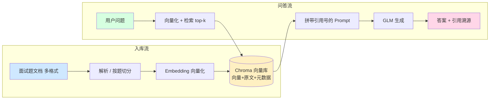

# 项目总结 · 校招面试题库 RAG 垂直问答系统

> 本文档是项目的「单一信息源」，供求职方向咨询、简历撰写、面试复盘等下游对话直接取用。
> 内容以 2026-09-01 代码实况为准，非商用学习作品集项目 #2。

---

## 1. 项目概览

| 项 | 内容 |
|---|---|
| 项目名称 | 校招软件开发面试题库 · RAG 垂直问答系统 |
| 定位 | 个人作品集项目 #2（共 3 个），服务于「校招软件工程师」面试备考 |
| 类型 | 检索增强生成（RAG）垂直问答系统 |
| 价值主张 | 上传面试题文档 → 自动按题切分向量化 → 基于检索增强生成答案 → **答案带引用溯源**（防幻觉） |
| 性质 | 非商用学习作品，目标是展示「能应对真实业务场景」的工程能力，而非商用产品 |
| 部署状态 | **已上线 Render Free**（`https://campus-interview-rag.onrender.com`），Docker 多阶段构建 |
| 代码仓库 | GitHub Public（含全部源码、架构图、API 文档、分阶段实现记录） |
| 完成度 | 功能完整：文档入库 / 语义检索 / RAG 问答 / 引用溯源 / 鉴权限流 / 专题刷题 / 模拟面试 / 示例题库 |

**为什么做这个项目**：直接服务求职场景，面试题是天然 Q&A 语料，最能体现 RAG「带出处、防幻觉」的价值；边建边复习，一举两得。

---

## 2. 技术栈总表

| 层 | 选型 | 版本/说明 |
|---|---|---|
| 后端框架 | **FastAPI** | 0.115.6，异步、自带 OpenAPI 文档、Pydantic 校验天然契合输入校验 |
| 向量库 | **Chroma** | 1.5.9（嵌入式，持久化）。锁版本原因：0.6.3 强依赖 `chroma-hnswlib==0.7.6` 仅源码包无 wheel，Windows 需 MSVC 14 才能编译；1.5.9 将其降为可选依赖，免 MSVC |
| Embedding | **阿里百炼 `text-embedding-v3`**（默认）/ 智谱 `embedding-3` | 默认 1024 维（可切 2048 维），`EMBEDDING_PROVIDER` 环境变量切换；中文语义强 |
| 大模型 | **智谱 GLM-4**（开发期 `glm-4-flash`） | 中文问答质量好，需 API Key |
| 前端 | **Vue 3 + Vite 5** | 组件化，经 Vite 代理 `/api` 对接后端 |
| 部署 | **Docker 多阶段 + Render Free** | 前端 build 后拷入后端 `/app/static` 同源托管；`start.py` 读 `$PORT` |
| 运行环境 | **Python 必须 3.12**（禁用 3.13） | `chroma-hnswlib` 全平台无 cp313 的 wheel，3.13 装不上 Chroma（含 Render 部署） |

**双 Key 设计**：智谱 Key（GLM 问答生成用）+ 阿里百炼 Key（DashScope embedding 用）。默认 embedding 走 DashScope，因其免费档 50 万 token 且不像智谱免费档 embedding 那样账户级持续 429 限流。

---

## 3. 系统架构

入库流把文档变成可检索向量；问答流把问题变成带出处的答案：



**关键数据流**：每个 chunk 携带 `source / subject / q_index / title / difficulty / q_type / question_only` 元数据；检索 top-k 后给每段编 `[1][2]…`，Prompt 约束「仅用给定资料、无则明说」，GLM 返回后把 `[n]` 映射回元数据，随 `citations` 返回；前端按结构化 `citations` 渲染出处卡片（而非正则解析文本，更健壮、防 XSS）。

---

## 4. 功能清单

| 功能 | 说明 | 作品集角度 |
|---|---|---|
| 多格式文档入库 | 支持 **14 种格式**（Word / PDF / PPT / Excel / CSV / JSON / HTML / Markdown / TXT / LOG 等），自动按「题」切分 | 解析与切分解耦、依赖按需 lazy import、GBK 编码回退、老格式给转换建议 |
| 语义检索 | Chroma 持久化向量库，ANN 近似最近邻 top-k | 相似度阈值过滤高频词撞库噪声 |
| RAG 问答 | 检索片段 + 问题拼入受约束 Prompt，GLM 生成 | 抑制幻觉的核心机制 |
| 引用溯源 | 每题带科目/题号/来源，答案下可展开出处卡片 | RAG 的「可信」卖点 |
| 专题刷题 | 按学科分组列题 + 难度/题型筛选 | 前端 `onMounted` 自动 load + 父组件切面板强制 reload |
| 模拟面试 | 随机抽题 → 限时（90s/题）→ 自评 → 评分 + 错题列表 | 题干/答案拆开建模，默认只显题干，自评后才揭晓 |
| 一键示例题库 | 内置 70 道样例题库，幂等灌入 | 降低首次体验门槛 |
| 题库管理 | 按来源删除、清空（二次确认） | 防误删的真实业务考量 |
| 鉴权中间件 | `X-API-Key` 或 `Bearer` 校验，无效 → 401 | 中间件洋葱模型，先于限流执行 |
| 限流中间件 | 按客户端 IP 60s 固定窗口计数，超频 → 429 | 单机内存实现，公开路径豁免 |
| 请求校验 | Pydantic `field_validator` 校验 `query` 非空、`top_k∈[1,10]` | 非法 → 422，省手写 if |
| 自动 seed | 启动后台线程检测空库 → 自动灌 70 样例 | 应对 PaaS 临时文件系统重启丢数据 |

---

## 5. 工程化亮点（真实业务场景意识）

以下是对招聘方最有说服力的「真实业务」考量，代码注释与文档中均有讲清：

1. **输入校验**：Pydantic 模型统一拦截空 query、越界 top_k，返回 422 而非 500。
2. **体积/类型防护**：上传接口先读字节判 10MB 上限（413）、按扩展名校验类型白名单（415）、解析失败给人话（400/502），避免大文件打爆免费层内存。
3. **鉴权 + 限流分层**：API Key 中间件（最外层，先挡无效 key 不消耗配额）→ 限流中间件（内层，仅对通过鉴权的请求计数）；`/health`、`/docs`、`/api/usage` 等公开路径放行。
4. **按题切分 + 元数据建模**：不按固定字数切，一道题一个 chunk，保住单题语义；`question_only`（纯题干）与 `content`（题面+答案）显式拆开，前端默认只显题干、揭晓答案才整段显示——避免「一渲染就泄露答案」。
5. **通用文档隔离**：非 `### Q` 结构的文档走通用兜底切分，标记为 `subject=通用文档`；模拟面试默认排除通用文档，避免「一段 Word 正文当一题」。
6. **多格式解析鲁棒性**：14 种格式；中文 txt 按 utf-8→utf-8-sig→gbk→gb18030→big5→latin-1 逐级回退；不支持的老格式（.doc/.xls/.ppt）给「另存为 .docx」的可执行建议。
7. **Embedding provider 可切换**：智谱 429 时零代码改动切到 DashScope（`EMBEDDING_PROVIDER` 环境变量）；MOCK 模式用确定性伪向量跑通全流程（仅验证链路，检索质量无意义）。
8. **同源部署 + CORS 环境变量**：多阶段 Docker 把前端 dist 拷入后端 `/app/static`，根路径即 UI、`/api` 仍归后端；CORS 生产用 `ALLOWED_ORIGINS` 收敛。
9. **12-Factor 启动**：`start.py` 直接读 `os.getenv('PORT')`，绕开 PaaS 的 shell 展开与 Railway `cd` 包装器坑。
10. **自动 seed 不阻塞启动**：`_auto_seed` 用 `asyncio.to_thread` 跑后台线程，uvicorn 立刻 listen 端口，避免超过 PaaS healthcheck 窗口被判 unhealthy 重启。

---

## 6. 项目结构与关键文件

```
project-2/
├── backend/
│   ├── app/
│   │   ├── main.py               # 入口：lifespan 自动 seed + CORS + 中间件 + 静态托管
│   │   ├── api/
│   │   │   ├── __init__.py       # /hello 探活
│   │   │   └── documents.py      # /upload /search /ask /by-subject /random /load-sample /stats /clear /by-source /formats
│   │   ├── core/
│   │   │   ├── config.py         # 配置中心（环境变量读取，密钥不写死）
│   │   │   └── security.py       # API Key 鉴权 + 按 IP 限流 中间件
│   │   └── services/
│   │       ├── zhipu.py          # 智谱 embedding / 生成 客户端（含 MOCK）
│   │       ├── dashscope.py      # 阿里百炼 embedding 客户端（OpenAI 兼容）
│   │       ├── embeddings.py     # Embedding 统一入口（provider 切换 + MOCK）
│   │       ├── vector_store.py   # Chroma 封装（PersistentClient/upsert/query + 阈值过滤）
│   │       ├── ingestion.py      # 按题切分 + 通用兜底切分 + 入库
│   │       ├── parsers.py        # 14 种格式解析 + 编码回退 + 不支持格式建议
│   │       └── rag.py            # RAG 问答：检索→拼Prompt→生成→溯源
│   ├── data/sample_interview.md  # 样例题库（10 科 70 题）
│   ├── scripts/                  # verify_stage1.py / reindex.py / test_parsers.py
│   ├── chroma_db/                # Chroma 持久化（gitignore）
│   ├── requirements.txt          # 锁定 chromadb==1.5.9 等
│   ├── .env.example              # 密钥模板（真实 .env gitignore 不进仓库）
│   └── .env                      # 本地真实密钥（勿提交）
├── frontend/
│   └── src/
│       ├── api.js                # 统一请求层（自动带 X-API-Key，翻译 401/429/413/415）
│       ├── App.vue               # 三栏布局 + 模式切换 + 限流配额指示器
│       └── components/
│           ├── UploadPanel.vue   # 上传 / 载入示例题库 + 格式白名单
│           ├── ChatPanel.vue     # 提问 + 引用溯源卡片
│           ├── SubjectBrowser.vue# 专题刷题（学科分组 + 难度/题型筛选）
│           └── InterviewMode.vue # 模拟面试（限时/自评/评分）
├── Dockerfile                    # 多阶段：node 构建前端 → python 跑后端 + 拷 dist
├── start.py                      # 读 $PORT 启动（生产部署入口）
├── docs/                         # 部署/经验文档（见第 9 节）
└── examples/sample-interview-70q.md  # 示例题库离线副本
```

---

## 7. 部署实况（Render Free）

- **URL**：`https://campus-interview-rag.onrender.com`
- **方式**：Docker 多阶段构建（commit 已含 `Dockerfile` / `start.py` / `.dockerignore`），无需改代码即可迁任何支持 Docker 的平台。
- **Environment 变量**（Render 控制台配置）：
  - `ZHIPU_API_KEY`（GLM 生成）
  - `DASHSCOPE_API_KEY` + `EMBEDDING_PROVIDER=dashscope`（向量化，避免智谱 429）
  - `API_KEYS`（可选，演示用 `dev-rag-2026`）
  - `RATE_LIMIT_PER_MINUTE`（默认 30）
  - `CHROMA_PERSIST_DIR=./chroma_db`、`TOP_K` 等
- **自动 seed**：Render 临时文件系统重启清空 `chroma_db` 后，`_auto_seed()` 自动用 DashScope 灌入 70 道样例题，开箱即用。
- **关键踩坑**：Render 默认 Python 3.13 装不上 Chroma → 锁 3.12；`start.py` 读 `$PORT` 绕过 shell 展开坑；embedding 必须显式设 `dashscope` 否则持续 429。

---

## 8. 本地运行（快速开始）

```bash
# 后端（Python 3.12）
cd backend
py -V:Astral/CPython3.12.14 -m venv .venv      # 或 python3.12 -m venv .venv
.venv/Scripts/activate
pip install -r requirements.txt
cp .env.example .env                            # 填 ZHIPU_API_KEY / DASHSCOPE_API_KEY / EMBEDDING_PROVIDER=dashscope
python scripts/reindex.py                       # 灌入 70 道样例题
python -m uvicorn app.main:app --port 8000

# 前端（另开终端）
cd frontend
npm install && npm run dev                      # http://localhost:5173
```

验证：访问 `/health` 返回 `{"status":"ok"}`；前端问「TCP 三次握手的作用」应得答案 + 引用卡片。

---

## 9. API 一览

| 方法 | 路径 | 说明 | 鉴权 |
|---|---|---|---|
| GET | `/health` | 探活（返回 `api_key_set`） | 否 |
| GET | `/api/usage` | 当前 IP 限流配额用量 | 否 |
| GET | `/api/documents/stats` | 题库总段数 + 各来源分布 | 是 |
| GET | `/api/documents/formats` | 支持的文件格式白名单 | 是 |
| POST | `/api/documents/upload` | 上传文档（14 种格式）解析/切分/向量化入库 | 是 |
| POST | `/api/documents/load-sample` | 一键载入内置 70 道样例题（幂等） | 是 |
| POST | `/api/documents/clear` | 清空整个题库（需 `confirm=true`） | 是 |
| DELETE | `/api/documents/by-source/{source}` | 按来源删除某文档全部片段 | 是 |
| POST | `/api/search` | 语义检索 top-k 片段 | 是 |
| POST | `/api/ask` | RAG 问答，返回 `answer + citations` | 是 |
| GET | `/api/documents/by-subject` | 按学科分组列题（支持 `difficulty`/`q_type` 筛选） | 是 |
| GET | `/api/documents/random` | 随机抽 N 题（模拟面试，默认排除通用文档） | 是 |

---

## 10. 数据资产

- **样例题库**：10 个学科、70 道面试题，覆盖：
  Java、Python、计算机网络、操作系统、数据库（MySQL）、数据结构与算法、设计模式、前端（HTML/CSS/JS）、Redis 与缓存、分布式与微服务。
- **题型**：问答（qa）/ 选择（multi_choice）/ 判断（judge）/ 代码输出（code_output）。
- **难度**：基础 / 进阶 / 困难。
- 离线副本见 `examples/sample-interview-70q.md`，可下载自用。

---

## 11. 诚实性声明（给招聘方 / 求职者）

- **代码优先**：完整代码即作品本身，全部源码、架构、API 文档、分阶段记录公开在 GitHub。
- **非伪造**：RAG 检索、引用溯源、鉴权限流都是真实实现，非 demo 假数据；embedding/生成调用真实 LLM API。
- **限定认知**：免费档 LLM 有速率限制（故引入 DashScope 兜底）；向量库为嵌入式 Chroma（非分布式）；限流为单机内存实现（非 Redis 分布式）。这些都已在文档中诚实标注，可作为「下一步优化」谈。

---

## 12. 给求职者的提炼（可写进简历 / 口述的卖点）

**可迁移能力标签**：Python / FastAPI / RAG / 向量检索（Chroma）/ Prompt 工程 / Vue3 / Docker / 云服务部署（Render）/ API 鉴权与限流 / 多格式文档解析。

**适用岗位方向**：
- 实施工程师 / 数字化实施顾问（政企/制造/信创交付）—— 本项目的「真实业务场景意识」（输入校验、权限、限流、容错）正契合交付岗对系统稳健性的要求；
- 后端开发（Python）初级 —— RAG 全链路（解析→切分→向量化→检索→生成→溯源）是扎实的工程实践；
- AI 应用开发 —— 熟悉 LLM API 接入、embedding 选型、防幻觉的引用溯源机制。

**一句话项目描述（简历用）**：
> 独立开发「校招面试题库 RAG 问答系统」：基于 FastAPI + Chroma + 智谱/DashScope 大模型，实现多格式文档自动切分向量化、带引用溯源的 RAG 问答、专题刷题与模拟面试；含 API 鉴权、按 IP 限流、自动种子等工程化加固，Docker 多阶段构建部署至 Render Free。

**面试可展开讲的点**：① 为什么按题切分而非按字数；② 怎么用引用溯源抑制幻觉；③ 智谱 429 时如何零成本切换到 DashScope；④ PaaS 临时文件系统下自动 seed 的设计；⑤ 中间件洋葱模型与 401/429 分工。

---

## 13. 已知限制与后续

- 向量库为嵌入式 Chroma，未做多用户知识库隔离；
- 限流为单机内存实现，未用 Redis 分布式；
- 检索召回可优化为混合检索（向量 + BM25）+ 重排（rerank）；
- 可扩充更多学科/真实校招真题，或切换为团队共享知识库；
- 已跑通 Render，可平滑迁移 Railway / 自建服务器（镜像通用）。

---

## 14. 关键决策时间戳（便于追溯）

| 时间 | 决策 |
|---|---|
| 2026-08-20 | 确定项目方向：校招面试题库 RAG（直接服务求职） |
| 2026-08-24 | 选型 Python 3.12 + chromadb 1.5.9（避开 wheel 坑） |
| 2026-08-28 | embedding 切换至阿里百炼 DashScope，解决智谱 429 |
| 2026-08-31 | 段 A/B：面试只显题干+退出、专题刷题补难度筛选、示例题库扩至 70 题 |
| 2026-09-01 | 全局体检：修复 README 与真实代码脱节、抹除仓库内明文密钥、补 70 题一致性 |
